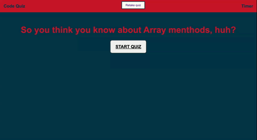

# Challenge #4. Web APIs Challenge: Code Quiz

## Code Quiz
--------------------------------------------
--------------------------------------------
As a Coding Bootcamp student, I want to practice my skills with Array Methods and JavaScript fundamentals in order to practice. I also want to be able to save my scores in order to guage my progress. 
---------------------------------------------
GIVEN that I am taking a code quiz:

*  I have a start screen, when 'start quix' button is pressed:
   - I am presented with the first question of the quiz, timer begins counting down.
*  When I choose the answer
   - If the answer is correct, answer choice turns green indicating I was right and next questions pops up.
   - If the answer is incorrect, answer choice turns red indicating I was wrong and I am given a 5 second penalty for choosing incorrectly.
* When the quiz is over
  - I am able to enter my name and my time score is stored into local storage and compared to other scores taken prior to my quiz.
  - I also have the option press the 'retake quiz' button to restart the quiz and try again.
----------------------------------------------------------

## Website URL: https://balloonicorn92.github.io/codeQuiz/
----------------------------------------------------------